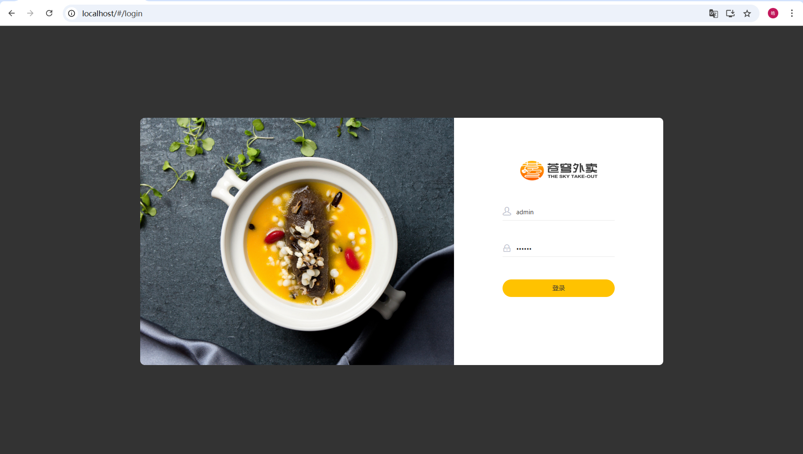
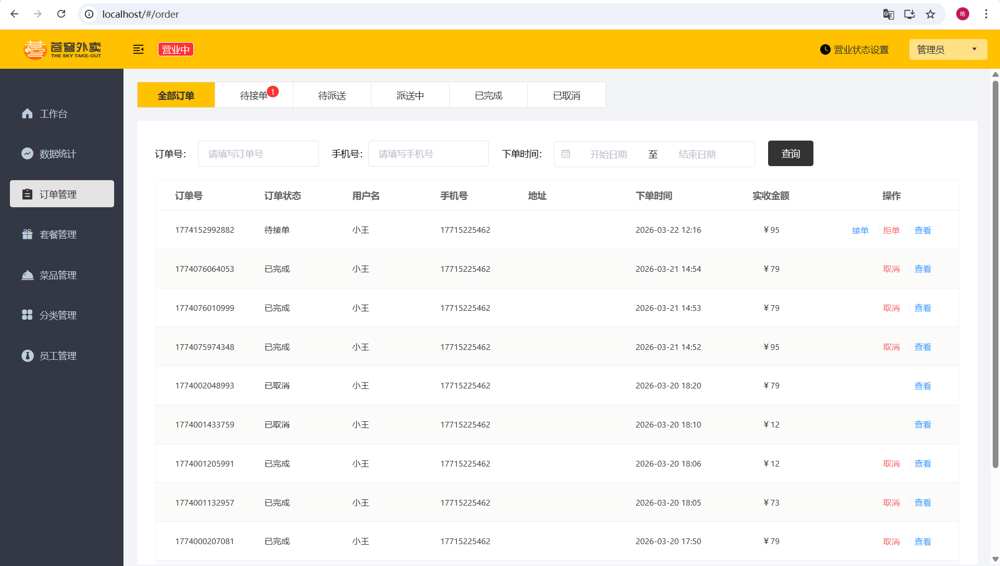
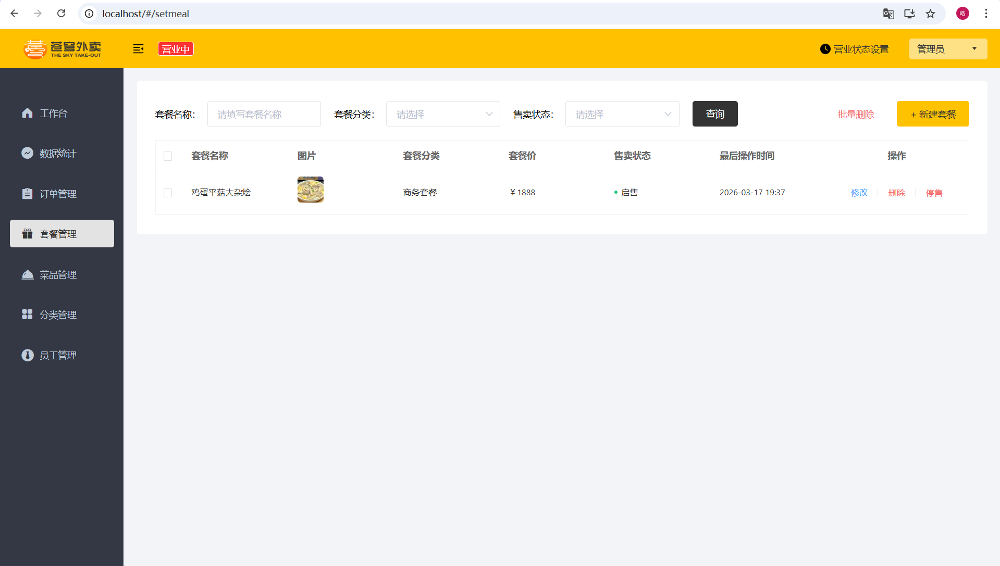
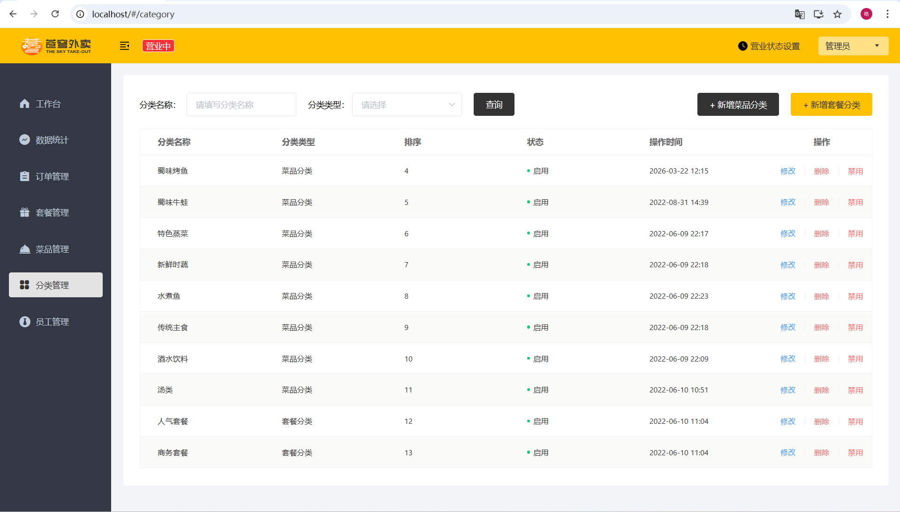

# 🍔 Sky Take-Out System

A backend-focused online food ordering system built with **Spring Boot + Vue**, featuring **Redis caching**, **WebSocket real-time updates**, and **JWT-based authentication**.

---

## 📖 Introduction

Sky Take-Out System is a food ordering project designed for both users and administrators.  
It supports core business functions such as dish browsing, shopping cart management, order placement, order processing, category management, and set meal management.

This repository mainly contains the **backend implementation** of the project, while the frontend pages shown in the screenshots are for demonstration purposes only.

---

## 📸 Preview

### Admin Login


### Order Management


### Set Meal Management


### Category Management


### User Mini Program Login


---

## 🚀 Features

### 👤 User Side
- Browse dishes and categories
- Add items to shopping cart
- Place orders
- Simulated online payment
- View and manage order history

### 🛠 Admin Side
- Manage dishes and categories
- Manage set meals
- Manage orders (accept, reject, dispatch, cancel)
- Manage employees
- View business statistics dashboard
- Configure shop status

### ⚡ System Features
- Redis caching for performance optimization
- WebSocket for real-time order notifications
- JWT-based authentication and authorization
- RESTful API design
- Layered architecture (Controller / Service / Mapper)

---

## 🏗 Tech Stack

### Backend
- Java 11
- Spring Boot
- MyBatis
- MySQL
- Redis
- WebSocket
- JWT

### Frontend
- Vue.js *(not included in this repository)*
- Element UI *(not included in this repository)*
- WeChat Mini Program *(not included in this repository)*

### Other
- Maven
- Git & GitHub

---

## 📂 Project Structure

```text
sky-take-out
├── screenshots            # Project screenshots
├── sky-common             # Common utilities and constants
├── sky-pojo               # Entity classes and DTO/VO objects
├── sky-server             # Core business logic and backend services
├── sql
│   └── sky.sql            # Database initialization script
├── README.md
└── pom.xml
